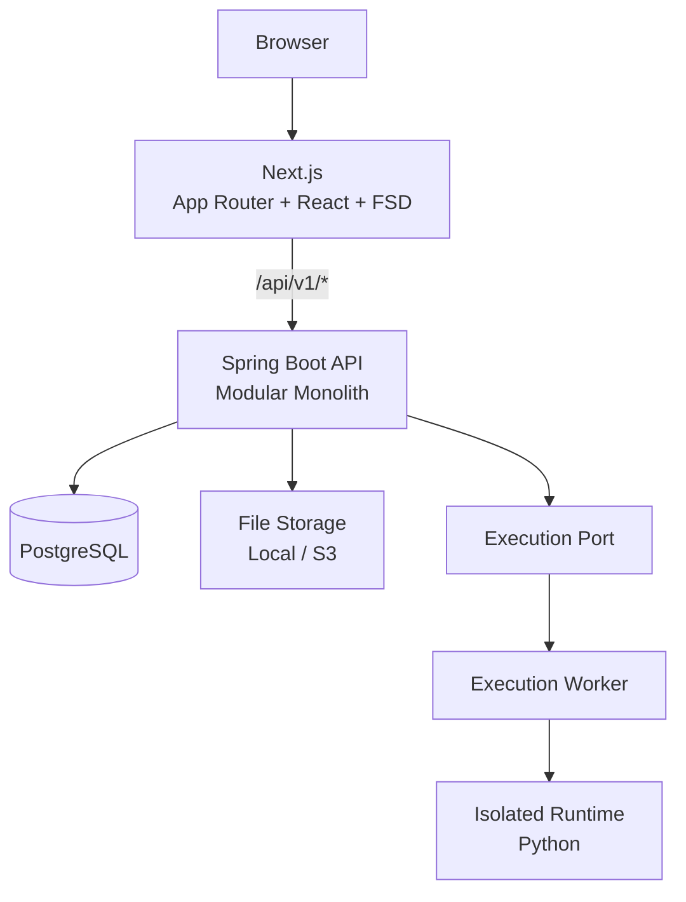
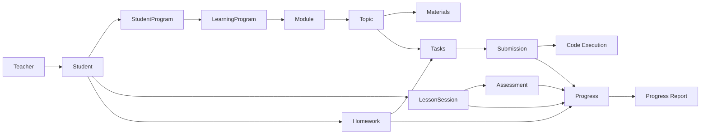

# Tutor Learning Platform

[English](#english) · [Русский](#русский)

A tutoring platform for individual learning workflows: students, learning programs, lesson sessions, homework, submissions, progress tracking, reports, and isolated code execution.

The MVP is subject-independent at its core. **Python** is the first specialized subject through programming tasks and an isolated execution runtime.

---

# English

## Overview

Tutor Learning Platform is a browser-first application for tutors who manage individual students and their learning process.

The platform is designed around a reusable learning domain rather than a single programming language. A teacher can create students before they have accounts, assign learning programs, record lessons, manage homework and tasks, track progress, and publish read-only progress reports.

### Main actors

- **Teacher** — manages students, programs, materials, sessions, homework, assessments, and reports.
- **Student** — studies materials, solves tasks, submits homework, and views personal progress.
- **Parent** — can receive read-only access to current progress or published reports through secure share tokens.
- **Execution Runtime** — runs untrusted user code outside the main Spring Boot process.

## Architecture

The MVP uses a **modular monolith** on the backend and **Next.js + Feature-Sliced Design** on the frontend.



### Backend modules

```text
auth
user
student
subject
program
content
session
task
homework
submission
assessment
progress
report
file
execution
```

Business modules are split by capability rather than by a single global technical layer.

Typical module structure:

```text
feature/
├── api/
├── application/
├── domain/
└── infrastructure/
```

Simple modules may use a smaller structure when extra layers would not add value.

## Technology stack

### Backend

- Java 21+
- Spring Boot
- Spring Security
- Spring Session JDBC
- Spring Data / JPA where appropriate
- PostgreSQL 16+
- Flyway
- OpenAPI / SpringDoc
- JUnit 5
- Testcontainers

### Frontend

- Next.js
- React
- TypeScript
- App Router
- Feature-Sliced Design
- TanStack Query
- React Hook Form
- Generated OpenAPI TypeScript client
- Vitest / Testing Library
- Playwright

### Infrastructure

- Docker / Docker Compose
- PostgreSQL
- Local or S3-compatible file storage
- Separate execution worker for untrusted code

## Core design decisions

### Student can exist without a User account

A teacher may create a student before registration.

```text
Teacher
  ↓
Student profile
  ↓
Invitation
  ↓
Student accepts invitation
  ↓
User account is linked to Student
```

`students.user_id` remains nullable until the invitation is accepted.

### Teacher ↔ Student ownership

Ownership is represented through `teacher_student_links`.

The MVP allows one active `PRIMARY` teacher per student. The database model leaves room for additional relation types later.

### LearningProgram vs StudentProgram

`LearningProgram` is a reusable program template.

`StudentProgram` represents an individual assignment of that program to a student and stores student-specific lifecycle and reporting settings.

```text
LearningProgram
      │
      ├── StudentProgram → Student A
      ├── StudentProgram → Student B
      └── StudentProgram → Student C
```

### Progress is derived from learning facts

Current progress is not stored as a separate mutable aggregate.

It is calculated from:

- lesson sessions;
- attendance;
- topic progress;
- homework;
- submissions;
- teacher assessments;
- assigned tasks and skills.

This avoids stale duplicated state.

### Historical reports are immutable snapshots

Published progress reports store a versioned JSON snapshot so historical reports do not change when progress formulas evolve.

### Code execution is isolated

User code is never executed directly inside the main Spring Boot process.

The execution worker is responsible for:

- isolated runtime creation;
- disabled network by default;
- CPU / RAM / process limits;
- execution timeout;
- safe stdout/stderr limits;
- hidden test execution.

The worker does not need direct access to the core application database.

## Authentication and security

The browser MVP uses **stateful server-side sessions**.

- Session cookie: `TUTOR_SESSION`
- `HttpOnly`
- `Secure` in production
- `SameSite=Lax`
- CSRF protection for state-changing requests
- CSRF header: `X-XSRF-TOKEN`
- passwords stored using Argon2 or BCrypt
- authentication secrets are not stored in `localStorage`
- public invitation/share tokens are stored only as hashes

API base path:

```text
/api/v1
```

Initial authentication endpoints:

```text
GET  /api/v1/auth/csrf
POST /api/v1/auth/register/teacher
POST /api/v1/auth/login
POST /api/v1/auth/logout
GET  /api/v1/auth/me
```

Teacher/student onboarding starts with:

```text
GET    /api/v1/teacher/students
POST   /api/v1/teacher/students
GET    /api/v1/teacher/students/{studentId}
PATCH  /api/v1/teacher/students/{studentId}

POST   /api/v1/teacher/students/{studentId}/invites
GET    /api/v1/teacher/students/{studentId}/invites
DELETE /api/v1/teacher/students/{studentId}/invites/{inviteId}

GET    /api/v1/public/student-invitations/{token}
POST   /api/v1/public/student-invitations/{token}/accept
```

## Data model

The PostgreSQL schema is implemented incrementally with Flyway migrations.

Major areas:

```text
Identity
  users
  user_roles
  teachers

Student relationship
  students
  teacher_student_links
  student_invites

Programs
  subjects
  learning_programs
  student_programs
  modules
  topics
  student_topic_progress

Content
  file_assets
  lesson_materials

Sessions
  lesson_sessions
  lesson_session_topics
  teacher_assessments

Tasks
  tasks
  topic_tasks
  skills
  task_skills
  programming_task_configs
  task_test_cases

Homework and submissions
  homeworks
  homework_items
  submissions
  code_submissions

Reports
  learning_periods
  progress_reports
  progress_shares
  report_shares
```

UUIDs are used for domain entity identifiers. PostgreSQL stores timestamps as `timestamptz`, while Java uses `Instant`.

## Learning flow



## API contract

Spring Boot is the source of truth for the API contract.

```text
Spring DTO + validation
        ↓
SpringDoc OpenAPI
        ↓
/v3/api-docs
        ↓
Generated TypeScript client
        ↓
Frontend shared/api
        ↓
TanStack Query
```

Generated API files should not be edited manually.

## Testing strategy

### Backend

- unit tests for domain rules and calculations;
- integration tests for repositories, Flyway, security, ownership, and transactions;
- PostgreSQL integration through Testcontainers.

### Frontend

- unit/component tests with Vitest and Testing Library;
- Playwright for critical end-to-end flows.

### Critical E2E scenarios

- teacher registration/login/logout;
- teacher creates and edits a student;
- invitation creation and acceptance;
- student account linking;
- ownership isolation between teachers;
- program assignment;
- lesson recording;
- homework and submissions;
- progress calculation;
- report publishing and public access.

## Development

The architecture is intended to run locally with Docker Compose.

```bash
docker compose up
```

The first vertical-slice acceptance criteria require PostgreSQL, Spring Boot, and Next.js to start together and Flyway migrations to apply automatically.

OpenAPI is expected at:

```text
/v3/api-docs
```

Swagger UI is part of the backend API tooling.

> Exact environment variables, build commands, ports, and production deployment values depend on the repository configuration and should be documented alongside the implementation.

## Implementation roadmap

The MVP is implemented incrementally through vertical slices:

1. Foundation: repository, Docker Compose, Spring Boot, Next.js/FSD, PostgreSQL, Flyway, OpenAPI.
2. Authentication and students.
3. Programs: Subject → LearningProgram → StudentProgram → Module → Topic.
4. Materials.
5. Lesson sessions.
6. Homework + text tasks.
7. Code tasks + isolated execution.
8. Teacher assessments.
9. Current progress.
10. Parent current-progress sharing.
11. Learning periods.
12. Progress reports and PDF export.

## Project principles

- Prefer modular monolith boundaries over premature microservices.
- Keep the core learning domain independent from Python.
- Keep UI business calculations on the backend.
- Do not couple `LessonSession` to Zoom, Telegram, or future meeting providers.
- Do not execute untrusted code inside the main backend process.
- Preserve historical learning facts instead of hard-deleting them.
- Use generated OpenAPI contracts instead of duplicating DTOs manually.
- Keep complex analytics in dedicated read queries when JPA entity graphs are not a good fit.

## Documentation

The project architecture is defined by three main design artifacts:

- **Architecture Design v1**
- **ER Model v1 + PostgreSQL Physical Schema**
- **API Design v1 — Authentication + Students**

---

# Русский

## О проекте

Tutor Learning Platform — браузерная платформа для сопровождения индивидуального обучения.

Она строится вокруг универсальной учебной модели, а не вокруг конкретного языка программирования. Преподаватель может создавать учеников, назначать учебные программы, фиксировать занятия, выдавать домашние задания, отслеживать решения, рассчитывать прогресс и публиковать отчёты.

В MVP первой специализированной предметной областью является **Python**, для которого предусмотрены программные задания и изолированный runtime выполнения кода.

### Основные роли

- **Teacher / Преподаватель** — управляет учениками, программами, материалами, занятиями, ДЗ, оценками и отчётами.
- **Student / Ученик** — изучает материалы, решает задания, отправляет submissions и видит собственный прогресс.
- **Parent / Родитель** — получает read-only доступ к текущему прогрессу или опубликованному отчёту по share token.
- **Execution Runtime** — выполняет недоверенный пользовательский код вне основного Spring Boot процесса.

## Архитектура

Backend построен как **модульный монолит**, frontend — на **Next.js + Feature-Sliced Design**.


### Backend-модули

```text
auth
user
student
subject
program
content
session
task
homework
submission
assessment
progress
report
file
execution
```

Модули разделяются по бизнес-возможностям, а не через один общий набор глобальных `controller/service/repository`.

Типичная структура модуля:

```text
feature/
├── api/
├── application/
├── domain/
└── infrastructure/
```

Для простых модулей допускается более компактная структура.

## Технологии

### Backend

- Java 21+
- Spring Boot
- Spring Security
- Spring Session JDBC
- Spring Data / JPA там, где это подходит
- PostgreSQL 16+
- Flyway
- OpenAPI / SpringDoc
- JUnit 5
- Testcontainers

### Frontend

- Next.js
- React
- TypeScript
- App Router
- Feature-Sliced Design
- TanStack Query
- React Hook Form
- генерируемый TypeScript client по OpenAPI
- Vitest / Testing Library
- Playwright

### Infrastructure

- Docker / Docker Compose
- PostgreSQL
- Local или S3-compatible file storage
- отдельный execution worker для пользовательского кода

## Основные решения

### Student существует независимо от User account

Преподаватель может создать ученика до его регистрации.

```text
Teacher
  ↓
Student profile
  ↓
Invitation
  ↓
Student принимает приглашение
  ↓
User account связывается со Student
```

До принятия приглашения `students.user_id = NULL`.

### Ownership Teacher ↔ Student

Связь хранится через `teacher_student_links`.

В MVP у ученика может быть только один активный `PRIMARY` преподаватель. Схема оставляет возможность добавить дополнительные типы связи позже.

### LearningProgram и StudentProgram — разные сущности

`LearningProgram` — шаблон программы.

`StudentProgram` — конкретное назначение этой программы ученику с индивидуальным lifecycle и настройками отчётности.

```text
LearningProgram
      │
      ├── StudentProgram → Student A
      ├── StudentProgram → Student B
      └── StudentProgram → Student C
```

### Current Progress не хранится отдельной таблицей

Прогресс рассчитывается из учебных фактов:

- занятий;
- посещаемости;
- состояния тем;
- домашних заданий;
- submissions;
- оценок преподавателя;
- назначенных задач и навыков.

Так система не хранит дублирующий derived state, который может устареть.

### Исторические отчёты сохраняют snapshot

После публикации отчёт хранит versioned JSON snapshot. Изменение формул текущего прогресса не должно переписывать старые отчёты.

### Выполнение кода изолировано

Пользовательский код не запускается через основной Spring Boot процесс.

Execution worker отвечает за:

- изолированный runtime;
- отключённую сеть по умолчанию;
- ограничения CPU / RAM / количества процессов;
- timeout;
- ограничение stdout/stderr;
- hidden test cases.

Worker не должен иметь прямой доступ к основной БД приложения без необходимости.

## Аутентификация и безопасность

Browser-first MVP использует **stateful server-side session**.

- cookie: `TUTOR_SESSION`;
- `HttpOnly`;
- `Secure` в production;
- `SameSite=Lax`;
- CSRF protection для state-changing запросов;
- CSRF header: `X-XSRF-TOKEN`;
- пароли — Argon2 или BCrypt;
- auth secrets не хранятся в `localStorage`;
- invitation/share tokens хранятся в БД только в виде hash.

Base API:

```text
/api/v1
```

Основные auth endpoints:

```text
GET  /api/v1/auth/csrf
POST /api/v1/auth/register/teacher
POST /api/v1/auth/login
POST /api/v1/auth/logout
GET  /api/v1/auth/me
```

Первый student onboarding flow:

```text
GET    /api/v1/teacher/students
POST   /api/v1/teacher/students
GET    /api/v1/teacher/students/{studentId}
PATCH  /api/v1/teacher/students/{studentId}

POST   /api/v1/teacher/students/{studentId}/invites
GET    /api/v1/teacher/students/{studentId}/invites
DELETE /api/v1/teacher/students/{studentId}/invites/{inviteId}

GET    /api/v1/public/student-invitations/{token}
POST   /api/v1/public/student-invitations/{token}/accept
```

## Модель данных

PostgreSQL schema развивается поэтапно через Flyway migrations.

Основные области:

```text
Identity
  users
  user_roles
  teachers

Student relationship
  students
  teacher_student_links
  student_invites

Programs
  subjects
  learning_programs
  student_programs
  modules
  topics
  student_topic_progress

Content
  file_assets
  lesson_materials

Sessions
  lesson_sessions
  lesson_session_topics
  teacher_assessments

Tasks
  tasks
  topic_tasks
  skills
  task_skills
  programming_task_configs
  task_test_cases

Homework and submissions
  homeworks
  homework_items
  submissions
  code_submissions

Reports
  learning_periods
  progress_reports
  progress_shares
  report_shares
```

Для domain entities используются UUID. В PostgreSQL время хранится как `timestamptz`, в Java — как `Instant`.

## Учебный поток


## API contract

Источником истины для HTTP-контракта является Spring Boot.

```text
Spring DTO + validation
        ↓
SpringDoc OpenAPI
        ↓
/v3/api-docs
        ↓
Generated TypeScript client
        ↓
Frontend shared/api
        ↓
TanStack Query
```

Сгенерированные API-файлы не редактируются вручную.

## Тестирование

### Backend

- unit tests для domain rules и расчётов;
- integration tests для repositories, Flyway, security, ownership и транзакций;
- PostgreSQL через Testcontainers.

### Frontend

- Vitest и Testing Library для unit/component tests;
- Playwright для критических E2E сценариев.

### Основные E2E сценарии

- регистрация/login/logout преподавателя;
- создание и изменение ученика;
- создание и принятие invitation;
- связывание Student с User account;
- изоляция ownership между преподавателями;
- назначение программы;
- фиксация занятия;
- домашнее задание и submissions;
- расчёт прогресса;
- публикация отчёта и public access.

## Запуск

Архитектура предусматривает локальный запуск через Docker Compose.

```bash
docker compose up
```

Acceptance criteria первого vertical slice требуют, чтобы вместе поднимались PostgreSQL, Spring Boot и Next.js, а Flyway migrations применялись автоматически.

OpenAPI:

```text
/v3/api-docs
```

Swagger UI входит в backend API tooling.

> Точные environment variables, build-команды, порты и production-конфигурация зависят от текущей структуры репозитория и должны документироваться вместе с реализацией.

## План реализации

MVP развивается вертикальными срезами:

1. Foundation: repository, Docker Compose, Spring Boot, Next.js/FSD, PostgreSQL, Flyway, OpenAPI.
2. Auth + Students.
3. Programs: Subject → LearningProgram → StudentProgram → Module → Topic.
4. Materials.
5. Lesson Sessions.
6. Homework + TEXT Task.
7. CODE Task + isolated execution.
8. Teacher Assessment.
9. Current Progress.
10. Parent Current Progress share.
11. Learning Periods.
12. Progress Reports и PDF.

## Принципы проекта

- Не переходить к микросервисам без реальной необходимости.
- Не привязывать core learning domain к Python.
- Не рассчитывать итоговые бизнес-показатели на frontend.
- Не связывать `LessonSession` напрямую с Zoom, Telegram или будущим Meeting.
- Не запускать пользовательский код внутри основного backend-процесса.
- Сохранять учебную историю и предпочитать archive/status вместо hard delete.
- Генерировать frontend API contract из OpenAPI вместо ручного дублирования DTO.
- Для сложных read-heavy запросов использовать отдельные query repositories / SQL projections, если JPA entity graph становится неудобным.

## Документация

Архитектура проекта зафиксирована в трёх основных документах:

- **Architecture Design v1**
- **ER Model v1 + PostgreSQL Physical Schema**
- **API Design v1 — Authentication + Students**
